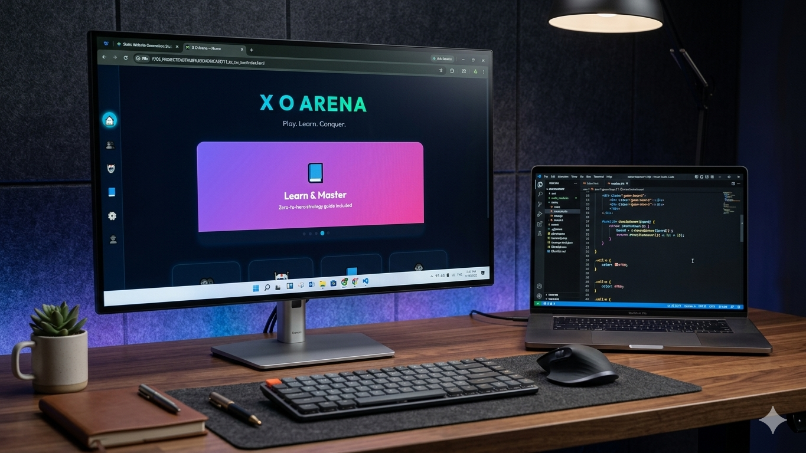
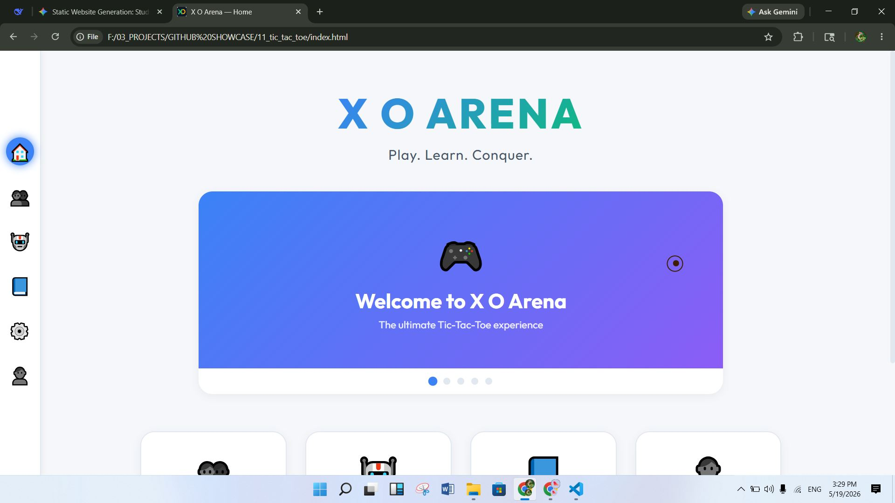
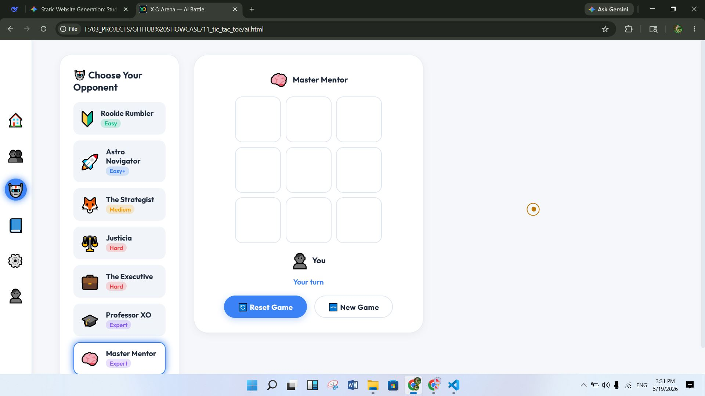
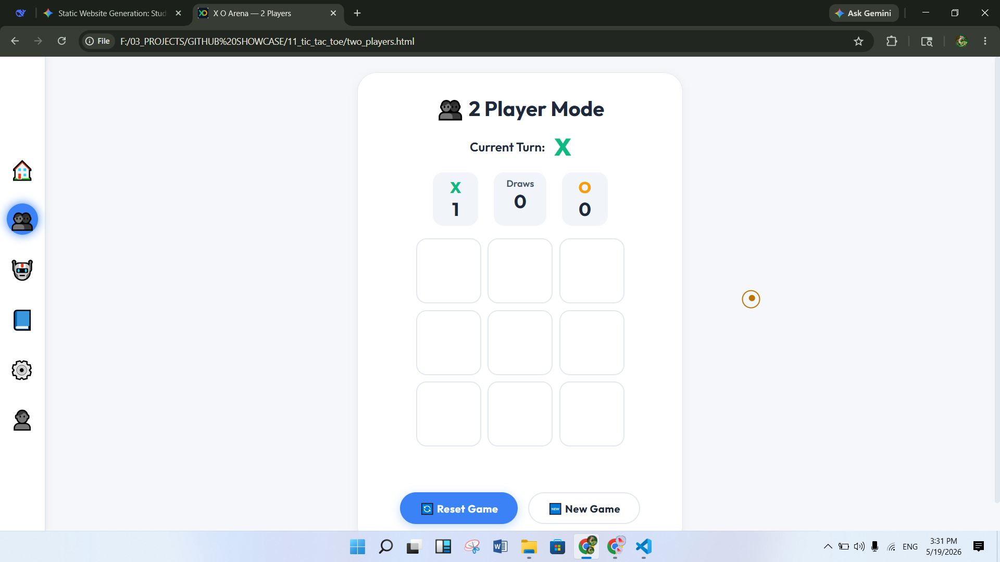
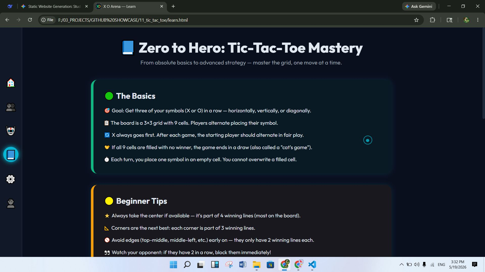
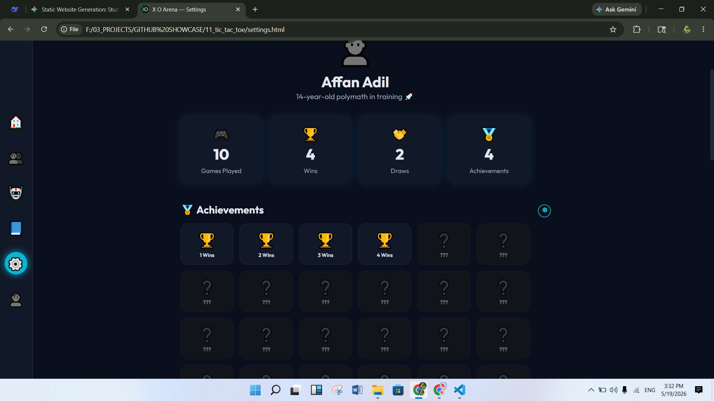
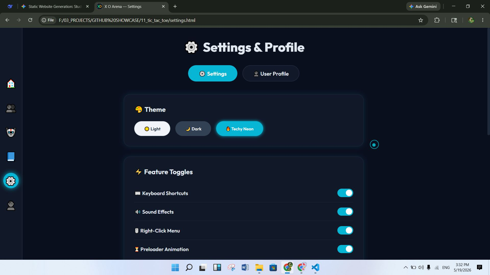
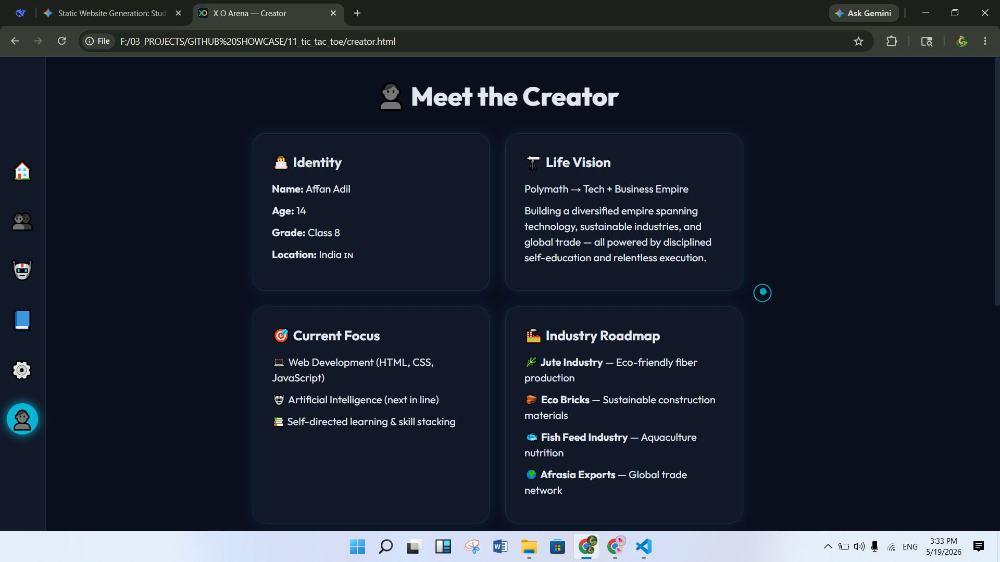
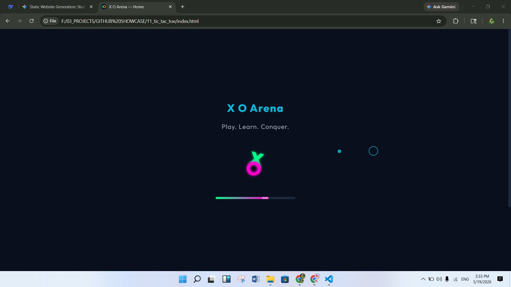

# 🎮 X O Arena

> A modern, feature-rich Tic Tac Toe game with AI opponents, achievements, and immersive gameplay

<div align="center">

[](https://developer.mozilla.org/en-US/docs/Web/HTML)
[](https://developer.mozilla.org/en-US/docs/Web/CSS)
[](https://developer.mozilla.org/en-US/docs/Web/JavaScript)
[](LICENSE)
[](https://github.com)

**[🎯 Play Now](#live-demo)** • **[📖 Learn](#features)** • **[🤝 Contribute](#contributing)**

</div>

---

## 📋 Overview

**X O Arena** is a sophisticated Tic Tac Toe game built with vanilla HTML, CSS, and JavaScript. It combines classic gameplay with modern UX/UI design, offering multiple game modes, challenging AI opponents, a comprehensive achievement system, and beautiful theme options. Perfect for both casual players and competitive gaming enthusiasts.

---

## ✨ Features

### 🎮 Game Modes
- **Solo Play** - Challenge 7 AI opponents with different difficulty levels
- **2-Player Mode** - Local multiplayer for head-to-head competition
- **Learn Mode** - Educational resources and tutorials for strategy improvement

### 🤖 Intelligent AI System
- **7 Unique AI Bots** with progressive difficulty:
  - 🥚 **Rookie** - Perfect for beginners
  - 🧑‍🏫 **Mentor** - Strategic gameplay
  - 👨‍🎓 **Professor** - Advanced tactics
  - 🎯 **Strategist** - Expert-level play
  - 💼 **Executive** - Master strategist
  - ⚖️ **Justicia** - Unbeatable opponent
  - 🚀 **Astro** - Ultimate AI challenge

### 🏆 Achievement System
- **120+ achievements** to unlock
- **Player statistics** tracking (wins, losses, draws, streaks)
- **Progress tracking** with local storage persistence
- **Special rewards** for reaching milestones

### 🎨 Design & Themes
- **Multi-Theme Support**:
  - 🌞 Light Theme
  - 🌙 Dark Theme
  - ⚡ Techy Theme (neon/cyberpunk style)
- **Dynamic theme switching** with keyboard shortcuts
- **Responsive design** - Works on desktop, tablet, and mobile
- **Custom cursor** with interactive animations
- **Smooth transitions** and polished animations

### 🔊 Audio Experience
- **Click sounds** for interactive feedback
- **Victory fanfare** when you win
- **Sound toggle** in settings

### ⌨️ Advanced Features
- **Keyboard shortcuts** for power users
- **Right-click context menu** with quick actions
- **Preloader animation** for smooth app startup
- **Toast notifications** for game events
- **Theme cycling** with keyboard hotkey
- **Local data persistence** using browser storage

---

## 📸 Screenshots

### Game Showcase

*Immersive desktop gameplay experience*

### Home Page

*Welcome screen with game mode selection*

### AI Battle

*Challenge 7 different AI opponents*

### Two Player Mode

*Head-to-head local multiplayer gameplay*

### Learning Center

*Strategy guides and gameplay tutorials*

### Achievement System

*Track your progress with 120+ unlockable achievements*

### Customization

*Theme selection, audio settings, and preferences*

### About Developer

*Developer information and project details*

### Startup Experience

*Beautiful preloader animation*

---

## 🛠 Tech Stack

| Category | Technologies |
|----------|--------------|
| **Frontend** | HTML5, CSS3, Vanilla JavaScript (ES6+) |
| **Storage** | Browser LocalStorage API |
| **Styling** | CSS3 (Flexbox, Grid, Animations, Transitions) |
| **Architecture** | Modular JavaScript with IIFE pattern |
| **Design** | Responsive, Mobile-first approach |

**Key Libraries & APIs Used:**
- HTML5 Audio API
- Web Storage API
- DOM APIs
- CSS Custom Properties (Variables)

---

## 🚀 Installation & Setup

### Prerequisites
- Modern web browser (Chrome, Firefox, Safari, Edge)
- No server or build tools required!

### Quick Start

1. **Clone the repository**
   ```bash
   git clone https://github.com/yourusername/xo-arena.git
   cd xo-arena
   ```

2. **Open in browser**
   ```bash
   # Simply open index.html in your browser
   # Option 1: Direct file
   open index.html

   # Option 2: Using a local server (recommended)
   python -m http.server 8000
   # Then visit http://localhost:8000
   ```

3. **Start playing!** 🎮
   - Select your preferred game mode
   - Choose difficulty level for AI
   - Adjust settings (theme, sound)
   - Start playing!

---

## 💻 Usage

### Playing the Game

**Navigation:**
- Use the left sidebar to navigate between different sections
- 🏠 Home - Main menu
- 👥 2 Players - Multiplayer mode
- 🤖 AI - Solo play against bots
- 📘 Learn - Strategy guides
- ⚙️ Settings - Customize experience
- 👤 Creator - About page

**Game Controls:**
- **Mouse**: Click on board cells to make moves
- **Keyboard**: Use number pad or arrow keys for quick moves
- **Theme Toggle**: Press `T` to cycle through themes
- **Right-click**: Open context menu for quick actions

**Settings:**
- Toggle sound on/off
- Switch between Light, Dark, and Techy themes
- Clear game data
- View statistics

---

## 📁 Folder Structure

```
xo-arena/
├── 📄 index.html              # Home page
├── 📄 two_players.html        # Multiplayer mode
├── 📄 ai.html                 # AI battle page
├── 📄 learn.html              # Learning center
├── 📄 settings.html           # Settings page
├── 📄 creator.html            # About developer
├── 📄 404.html                # Error page
│
├── 📁 css/                    # Stylesheets
│   ├── common.css             # Global styles
│   ├── themes.css             # Theme definitions
│   ├── home.css               # Home page styles
│   ├── game.css               # Game board styles
│   ├── ai.css                 # AI page styles
│   ├── learn.css              # Learning page styles
│   ├── settings.css           # Settings styles
│   ├── responsive.css         # Mobile responsiveness
│   └── [other styles]
│
├── 📁 js/                     # JavaScript modules
│   ├── gameLogic.js           # Core game logic
│   ├── common.js              # Shared utilities
│   ├── theme.js               # Theme management
│   ├── achievements.js        # Achievement system
│   ├── soundManager.js        # Audio control
│   ├── settingsUI.js          # Settings interface
│   ├── keyboardShortcuts.js   # Keyboard bindings
│   ├── customCursor.js        # Cursor animations
│   ├── carousel.js            # UI carousel
│   ├── preloader.js           # Startup animation
│   ├── rightClickMenu.js      # Context menu
│   ├── tabWelcome.js          # Welcome tab
│   │
│   ├── bots/                  # AI Opponents
│   │   ├── botBase.js         # Base AI class
│   │   ├── bot_Rookie.js      # Easy difficulty
│   │   ├── bot_Mentor.js      # Medium difficulty
│   │   ├── bot_Professor.js   # Hard difficulty
│   │   ├── bot_Strategist.js  # Expert difficulty
│   │   ├── bot_Executive.js   # Master difficulty
│   │   ├── bot_Justicia.js    # Impossible difficulty
│   │   └── bot_Astro.js       # Ultimate AI
│   │
│   ├── [other scripts]
│
├── 📁 assets/                 # Media files
│   ├── 📁 images/             # Game images
│   ├── 📁 screenshots/        # Screenshot files
│   └── 📁 sounds/             # Audio files
│       ├── click.mp3
│       └── winner.mp3
│
├── 📄 README.md               # This file
└── 📄 LICENSE                 # MIT License
```

---

## 🎯 Live Demo

**Play Online:** [🎮 Click here to play X O Arena](https://yourusername.github.io/xo-arena)

*Replace the URL with your actual GitHub Pages link once deployed*

### Quick Tips for First-Time Players
1. Start with **Rookie difficulty** to learn the basics
2. Explore different **themes** in settings
3. Try the **Learn mode** to improve your strategy
4. Challenge yourself with **harder AI opponents**
5. Unlock **achievements** to track your progress

---

## 🚦 Game Rules

**Standard Tic Tac Toe Rules:**
- Players take turns marking 3x3 grid spaces
- First player to get 3 marks in a row (horizontal, vertical, or diagonal) wins
- If all 9 spaces are filled with no winner, the game is a draw
- Win against all AI opponents to become the champion!

---

## 🎯 Future Improvements

### Planned Features (Roadmap)
- [ ] **Online Multiplayer** - Play against friends online
- [ ] **Leaderboard System** - Global player rankings
- [ ] **Advanced Analytics** - Detailed game statistics
- [ ] **Custom Board Sizes** - 4x4, 5x5 game variants
- [ ] **Replay System** - Watch previous games
- [ ] **Mobile App** - Native iOS/Android versions
- [ ] **Sound Customization** - Custom audio packs
- [ ] **Tournament Mode** - Competitive gameplay formats
- [ ] **Accessibility Improvements** - Enhanced WCAG compliance
- [ ] **Dark Mode Refinement** - More theme variations

### Enhancement Ideas
- [ ] Difficulty progression system
- [ ] Daily challenges
- [ ] Friend invites via URL
- [ ] Game analytics dashboard
- [ ] Social sharing features
- [ ] Elo rating system for competitive play

---

## 🤝 Contributing

We welcome contributions! Whether you're fixing bugs, adding features, or improving documentation, your help is appreciated.

### How to Contribute

1. **Fork** the repository
2. **Create** a feature branch
   ```bash
   git checkout -b feature/your-amazing-feature
   ```
3. **Commit** your changes
   ```bash
   git commit -m 'Add some amazing feature'
   ```
4. **Push** to the branch
   ```bash
   git push origin feature/your-amazing-feature
   ```
5. **Open** a Pull Request

### Development Guidelines
- Follow the existing code structure
- Use meaningful variable names
- Comment complex logic
- Test on multiple browsers
- Ensure responsive design works
- Maintain the modular JavaScript pattern

---

## 📝 License

This project is licensed under the **MIT License** - see the [LICENSE](LICENSE) file for details.

```
MIT License

Copyright (c) 2024 X O Arena Contributors

Permission is hereby granted, free of charge, to any person obtaining a copy
of this software and associated documentation files (the "Software"), to deal
in the Software without restriction, including without limitation the rights
to use, copy, modify, merge, publish, distribute, sublicense, and/or sell
copies of the Software...
```

---

## 👤 Author

**Created by:** [Your Name / Your Organization]

- 🌐 **Portfolio:** [Your Portfolio Link]
- 💼 **LinkedIn:** [Your LinkedIn]
- 🐙 **GitHub:** [Your GitHub Profile]
- 📧 **Email:** [Your Email]

### About This Project

X O Arena was created as a demonstration of modern web development practices including:
- Clean, modular JavaScript architecture
- Responsive CSS design with multiple themes
- User experience optimization
- Game AI implementation
- State management with LocalStorage
- Accessibility considerations

**Showcase Quality:** ⭐⭐⭐⭐⭐ Portfolio-Ready

---

## 🙏 Acknowledgments

- Inspired by classic Tic Tac Toe gameplay
- Built with care for an exceptional user experience
- Special thanks to all contributors and players

---

## 📞 Support & Feedback

Found a bug? Have a feature request? We'd love to hear from you!

- **Report Issues:** [Create an issue](https://github.com/yourusername/xo-arena/issues)
- **Request Features:** [Feature request](https://github.com/yourusername/xo-arena/issues/new?labels=enhancement)
- **Contact:** Reach out via email or social media (links above)

---

<div align="center">

### Made with ❤️ by the X O Arena Team

**[⬆ Back to Top](#-x-o-arena)**

© 2024 X O Arena. All rights reserved.

</div>
